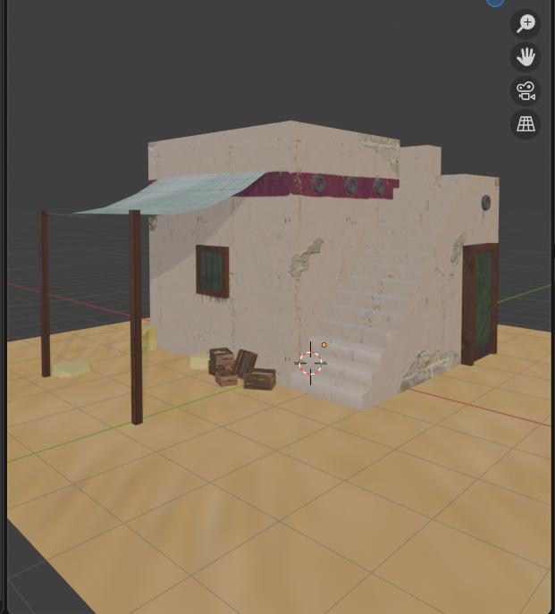
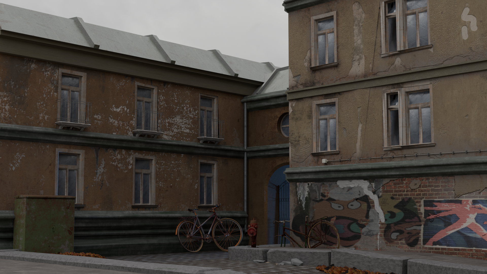

## In this portfolio I wanted to show a few of my projects.
 
The first one is my first attempt in shadering small stylized Middle East building which shows my ability to texturize with shaders.

 
The second one is already a big scene with all materials there created by myself, all of them are procedural and changeable in just a few clicks. Plus I wanted to show my ability in geometry nodes with procedural rain and pavement made with curve.

For this scene biggest part of the models were made by me. Some of highpoly ones I found I downloaded from free websites.

## More info about each project you can find in corresponding folders.

##For the second Big Scene projects I've made photo and video of processes, of nodes, of different variations of materials and models, and added them into text descriptions of each. 
