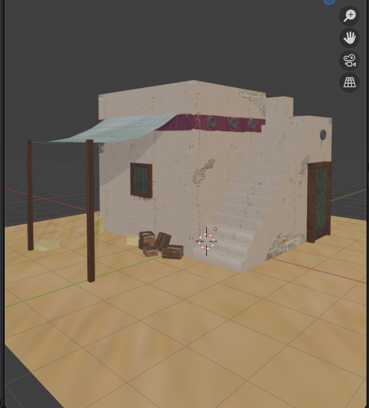
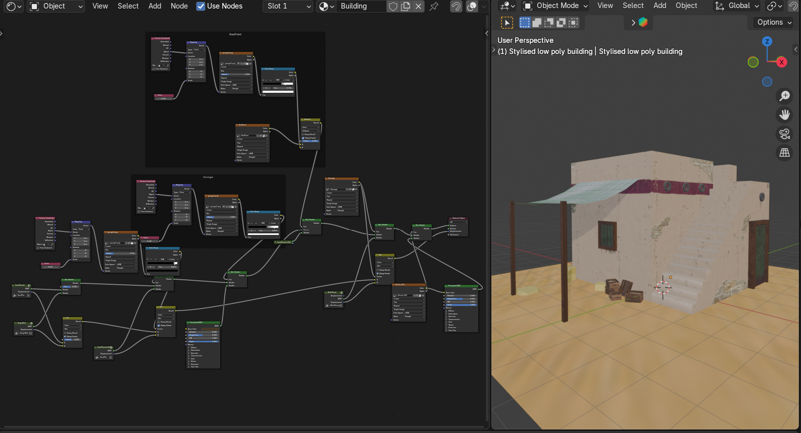

This is my first attempt at working with shaders. 
Here I used simple materials, masks, and textures — especially compared to the more complex, fully detailed scene I created later. 
Still, I wanted to include this part to show a glimpse of my learning process and how I started exploring shader creation.

In this document, I’ll showcase only the materials I created using Blender.

Fabric blend

Wood variations

Besides the base color and texture, I also added surface damage, ambient occlusion for extra detail, and hand-painted masks for stylization. 
For the wood material, I experimented with blending two types of wood and creating a peeling paint effect to add visual interest.
